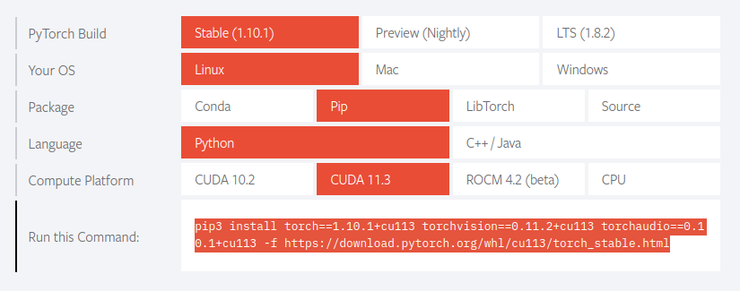

# Faster R-CNN in PyTorch and TensorFlow 2 w/ Keras
*Copyright 2021-2022 Bart Trzynadlowski*

## Overview

<p align="center">
   
</p>

This is a fresh implementation of the Faster R-CNN object detection model in both PyTorch and TensorFlow 2 with Keras, using Python 3.7 or higher. Although several years old now, Faster R-CNN remains a foundational work in the field and still influences modern object detectors.

I set out to replicate [the original paper](docs/publications/faster_rcnn.pdf) from scratch using Keras but quickly ran into difficulties and spent considerable time overcoming them. For the benfit of those undertaking a similar self-learning exercise -- whether involving this or other machine learning models -- my struggles, learnings, and observations are [documented here](#development-learnings).

My final results using the VOC2007 dataset's 5011 `trainval` images match the paper's. Convergence is achieved in 14 epochs (10 epochs at a learning rate of 0.001 and 4 more at 0.0001), consistent with the learning schedule the paper used. My implementation includes only a VGG-16 backbone as the feature extractor.

| Class | Average Precision |
|-------|-------------------|
| car        | 85.2% |
| horse      | 84.5% |
| cat        | 84.1% |
| bicycle    | 81.8% |
| dog        | 81.6% |
| person     | 81.1% |
| bus        | 79.3% |
| train      | 78.2% |
| cow        | 76.8% |
| motorbike  | 75.8% |
| tvmonitor  | 74.3% |
| sheep      | 72.7% |
| aeroplane  | 69.1% |
| diningtable| 68.2% |
| bird       | 66.9% |
| sofa       | 64.9% |
| boat       | 55.3% |
| bottle     | 53.7% |
| chair      | 52.3% |
| pottedplant| 40.4% |
|**Mean**   | **71.3%** |

## Background Material

Required literature for understanding Faster R-CNN:

- [*Very Deep Convolutional Networks for Large-Scale Image Recognition*](docs/publications/vgg16.pdf) by Karen Simonyan and Andrew Zisserman. Describes VGG-16, which serves as the backbone (the input stage and feature extractor) of Faster R-CNN.
- [*Fast R-CNN*](docs/publications/fast_rcnn.pdf) by Ross Girshick. Describes Fast R-CNN, a significant improvement over R-CNN. Faster R-CNN shares both its backbone and detector head (the final stages that produce boxes and class scores) with Fast R-CNN.
- [*Faster R-CNN: Towards Real-Time Object Detection with Region Proposal Networks*](docs/publications/faster_rcnn.pdf) by Shaoqing Ren, Kaiming He, Ross Girshick, and Jian Sun. Faster R-CNN improves upon Fast R-CNN by introducing a network that computes the initial object proposals directly, allowing all stages -- feature extraction, proposal generation, and final object detection -- to be trained together end-to-end.

Some informative web resources and existing code:

- [*Understanding Region of Interest -- (RoI Pooling)*](https://towardsdatascience.com/understanding-region-of-interest-part-1-roi-pooling-e4f5dd65bb44) by Kemal Erdem. A great explanation of RoI pooling.
- [*A Simple and Fast Implementation of Faster R-CNN*](https://github.com/chenyuntc/simple-faster-rcnn-pytorch) by Yun Chen. An excellent PyTorch implementation of Faster R-CNN.

## Environment Setup

Python 3.7 (for `dataclass` support) or higher is required and I personally use 3.8.5. Dependencies for the PyTorch and TensorFlow versions of the model are located in `pytorch/requirements.txt` and `tf2/requirements.txt`, respectively. Separate virtual environments for both are required.

Instructions here are given for Linux systems.

### PyTorch Setup with CUDA

As far as I know, it is not possible to obtain CUDA-enabled PyTorch packages using pip. Therefore, the required packages are commented out in `pytorch/requirements.txt` and must be obtained manually using a command found on the PyTorch web site. Begin by executing the following commands in the base Faster R-CNN source directory:

```
python -m venv pytorch_venv
source pytorch_venv/bin/activate
pip install -r pytorch/requirements.txt
```

Next, go to the [PyTorch web site](https://pytorch.org/) and use their installation picker to select a pip package compatible with your version of CUDA. In my case, CUDA 11.3, as shown.




Run the command shown, e.g.:

```
pip3 install torch==1.10.1+cu113 torchvision==0.11.2+cu113 torchaudio==0.10.1+cu113 -f https://download.pytorch.org/whl/cu113/torch_stable.html
```

If all goes well, this should supplant the CPU-only version of PyTorch that was pulled in from `requirements.txt`.

### TensorFlow 2 Setup

TensorFlow environment set up *without* CUDA is very straightforward. The included `tf2/requirements.txt` file should suffice.

```
python -m venv tf2_venv
source tf2_venv/bin/activate
pip install -r tf2/requirements.txt
```

Getting CUDA working is more involved and beyond the scope of this document. On Linux, I use an NVIDIA docker container and `tf-nightly-gpu` packages. On Windows, with CUDA installed, the ordinary `tensorflow` package should just work out of the box with CUDA support.


## Dataset

This implementation of Faster R-CNN accepts [PASCAL Visual Object Classes](http://host.robots.ox.ac.uk/pascal/VOC/) datasets. The datasets are organized by year and VOC2007 is the default for
training and benchmarking. Images are split into `train`, `val`, and `test` splits, representing the training, validation, and test datasets. There is also a `trainval` split, which is the union of
`train` and `val`. This is what Faster R-CNN is trained on and `test` is used for validation. This is configurable on the command line.

A script is included to automatically fetch and extract VOC2007 in the default location: `download_dataset.sh`. If your dataset is in a different location, use `--dataset-dir` to point the program to it.

## Pre-Trained Models and Initial Weights

To train the model, initial weights for the shared VGG-16 layers are required. Keras provides these but PyTorch does not. Instead, the PyTorch model supports initialization from one of two sources:

1. Pre-trained VGG-16 Caffe weights that can be found online as `vgg16_caffe.pth` (SHA1: `e6527a06abfac585939b8d50f235569a33190570`).
2. Pre-trained VGG-16 weights obtained using [my own Keras model](https://github.com/trzy/VGG16).

Fortunately, `vgg16_caffe.pth` and pre-trained Faster R-CNN weights for both the PyTorch and TensorFlow versions can be obtained using `download_models.sh`. My web host is not particularly reliable so if the site is down, try again later or contact me. The models were trained using the scripts included in this repository (`train_pytorch.sh` and `train_tf2.sh`).

When training the TensorFlow version of the model from scratch and no initial weights are loaded explicitly, the Keras pre-trained VGG-16 weights will automatically be used. When training the PyTorch version, remember to load initial VGG-16 weights explicitly, e.g.:

```
python -m pytorch.FasterRCNN --train --epochs=10 --learning-rate=1e-3 --load-from=vgg16_caffe.pth
```

## Running the Model

From the base directory and assuming the proper environment is configured, the PyTorch model is run like this:

```
python -m pytorch.FasterRCNN
```

And the TensorFlow model like this:
```
python -m tf2.FasterRCNN
```

Use `--help` for a summary of options or poke around the included scripts as well as `pytorch/FasterRCNN/__main__.py` and `tf2/FasterRCNN/__main__.py`. Most of the command line syntax is shared between both models. The Keras version has a few more configuration options.

### Training the Model

Numerous training parameters are available. Defaults are set to be consistent with the original paper. Some hyperparameters, such as mini-batch sampling and various detection thresholds, are hard-coded and not exposed via the command line.

Replicating the paper results requires training with stochastic gradient descent (the only option in the PyTorch version; the default in the TensorFlow version) for 10 epochs at a learning rate of 0.001 and a subsequent 4 epochs at 0.0001. The default momentum and weight decay are 0.9 and 5e-4, respectively, and image augmentation via random horizontal flips is enabled.

```
python -m pytorch.FasterRCNN --train --learning-rate=1e-3 --epochs=10 --load-from=vgg16_caffe.pth --save-best-to=results_1.pth
python -m pytorch.FasterRCNN --train --learning-rate=1e-4 --epochs=4 --load-from=results_1.pth --save-best-to=results_final.pth
```

This assumes that the dataset is present at `VOCdevkit/VOC2007/`. The mean average precision is computed from a subset of evaluation samples after each epoch and the best weights are saved at the end of training. The final model weights, regardless of accuracy, can also be saved using `--save-to` and checkpoints can be saved after each epoch to a directory using `--checkpoint-dir`.

**NOTE:** The data loader is simple but slow. If you have the CPU memory to spare (80-100 GB), `--cache-images` retains all images in memory after they are first read from disk, improving performance.

The TensorFlow version has additional options. Namely, a choice of optimizer (SGD or Adam), two RoI pooling implementations, and the option for the detector stage to output logits rather than probabilities. TensorFlow lacks an exact RoI pooling operation so by default we use an approximation involving `tf.image.crop_and_resize`. A custom RoI pooling layer was implemented as a learning exercise but is too slow for practical use. When loading saved weights, make sure to set options consistently.

For a complete list of options use `--help`.

### Running Predictions

There are three ways to run predictions on images:

1. `--predict`: Takes a URL (local file or web URL), runs prediction, and displays the results.
2. `--predict-to-file`: Takes a URL, runs prediction, and writes the results to an image file named `predictions.png`.
3. `--predict-all`: Takes a training split from the dataset (e.g., `test`, `train`, etc.) and runs prediction on all images within it. Writes each image result to a directory named after the split (e.g., `predictions_test/`, `predictions_train/`).

Examples of each:

```
python -m tf2.FasterRCNN --load-from=saved_weights.h5 --predict=http://trzy.org/files/fasterrcnn/gary.jpg
python -m tf2.FasterRCNN --load-from=saved_weights.h5 --predict-to-file=image.png
python -m tf2.FasterRCNN --load-from=saved_weights.h5 --predict-all=test
```

## Development Learnings

I encountered numerous difficulties getting these models working. My initial hope was to rely only on [the paper](docs/publications/faster_rcnn.pdf) but I had to give in and take a peak at existing code bases because there are some important details that are not expounded in the paper. If you are struggling with a
similar situation, take heart and remember you are not alone! Below are some important things I learned along the way.

### Use Object *and* Background Proposals for Training

The region proposal network (RPN) generates a box at each anchor consisting of a score (the *objectness score*) and coordinates. The published implementation uses a binary classification scheme with two mutually exclusive one-hot encoded class outputs per anchor: object and background. Softmax is applied to each pair of
signals for ever anchor. This is redundant and my implementation produces a single output with a sigmoid activation, which is equivalent. Each box is labeled as being an object (1.0) or background (0.0). Output scores above 0.5 can be interpreted as objects. These boxes are then passed to a labeling stage that decides whether they
sufficiently overlap with ground truth object boxes. If so, the boxes are labeled according to the class of the overlapping ground truth box. Otherwise, they are labeled as background. That is, the RPN can suggest that a box contains an object but it can be wrong. The set of labeled boxes, called *proposals* or *regions of interest*, are then passed to the detector stage.

I initially wrongly assumed that only those boxes that the RPN predicted to be *objects* should be passed along and labeled and that background results should be pruned immediately. The model learned but did so poorly. The mean average precision was well below 50% (possibly as low as 30-40%, if I remember correctly). I was stumped for an embarrassingly long time. The model
was obviously learning *something* only *not well enough*. Why?

Eventually, I relented and looked at other implementations and realized that RPN outputs should *not* be filtered. Rather, the objectness score should be used to sort them and the top *N* should be labeled and passed to the detector stage even if the RPN has classified them as background. In the original implementation, the
RPN object class output was used as a score and the background output was ignored entirely. In my implementation, the single output itself can be interpreted as a score.

In order to train the detector stage, Faster R-CNN needs to see a lot of examples. By putting too much trust into the RPN's judgment, I was excluding a huge number of proposals. And because all stages of Faster R-CNN are jointly trained, passing on boxes erroneously classified as background by the RPN still allows
the detector stage to continue learning because labeling (see the function `FasterRCNNModel._label_proposals()` in both versions of my model) is decided independently of the RPN's predictions. **Takeaway lesson:** if your object detector is learning but seems to be struggling to achieve high precision, consider whether
you are inadvertently limiting the amount of samples it is exposed to during training.

### Anchor Labeling Quality

Anchors are conceptually very simple but it is *very* easy to botch them. I rewrote my implementation several times and still got it wrong. I would not have discovered this if I had not compared my anchor labels to those of other implementations. One particularly nasty issue I encountered was that using double precision
coordinates could adversely affect anchor labeling. Consider the two examples below. The green boxes are the ground truth object boxes and the yellow boxes are the anchors that overlap sufficiently with a ground truth box to be labeled as *object* anchors. Specifically, those anchors whose *intersection-over-union* (IoU) with a
ground truth box is greater than or equal to 70% or, if no anchors meet this threshold, the highest scoring anchor(s).

<p align="center">
   
</p>

The image on the left is correct and the one on the right is wrong. Both were generated using identical code (`generate_anchor_maps()` in `anchors.py`) but the correct anchors were produced by casting the final results to `np.float32` from `np.float64`.

Why is it so sensitive? The reason is that it is acceptable for *multiple* anchors to be labeled as object anchors. In some cases, all anchors will have less than 70% IoU, and the ground truth box is small enough to fit entirely inside of multiple anchors, as happens here. In such a case, the IoU score should be
exactly the same but precision issues can cause a very tiny discrepancy, causing some anchors to appear to score "better" than others.

There are plenty of other ways to screw up anchor labeling, too. **Takeaway lesson**: don't double-check your anchor code. Don't triple-check it. Check it at least 10 times. And then check it 10 more times once your further along in implementing the rest of the model.

### Sampling Edge Proposals

**TODO: write me**

### Saving State in PyTorch

**TODO: write me**

### Instabilities in TensorFlow Due to Gradient Propagation

**TODO: write me**

### PyTorch Memory Leaks

**TODO: write me**

## Suggestions for Future Improvement

- Better data loaders that can prefetch samples automatically. Both PyTorch and TensorFlow provide functionality that ought to be able to do this.
- Support for [COCO](https://cocodataset.org) and other datasets.
- Support for batch sizes larger than one. This could be accomplished by resizing all images to the width of the largest image in the dataset, padding the additional space with black pixels, and ensuring that the ground truth RPN map ignores the padded space by marking anchors within it invalid. A substantial amount of code assumes a batch size of one and would need to be modified.
- Replacement of the ground truth RPN map -- which stores anchor validity, object/background label, and box delta regression targets in a single tensor -- with simpler lists of anchors and labels. This would greatly simplify the loss functions, among other code, and potentially improve performance.
- Better custom RoI pooling implementation for TensorFlow. This will almost certainly require writing a CUDA implementation. There are examples of this online.


