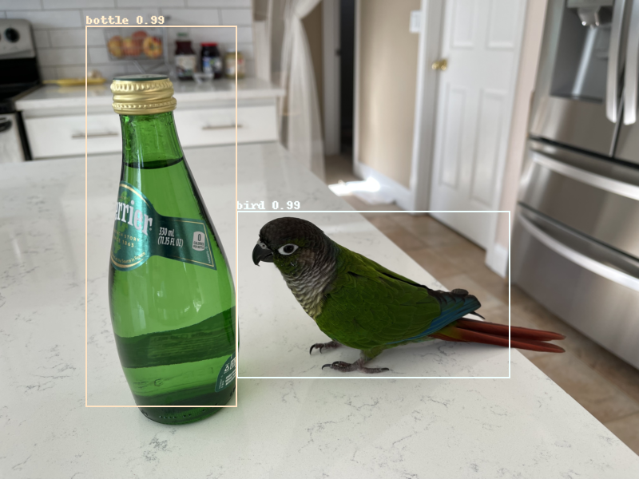
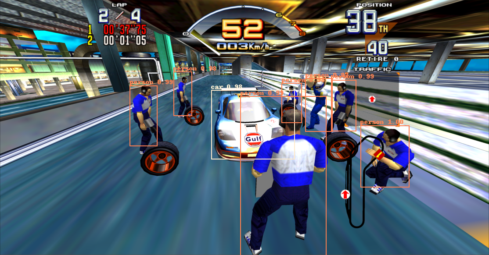
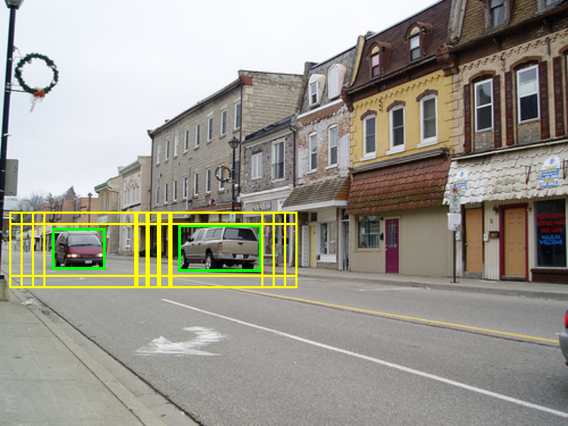
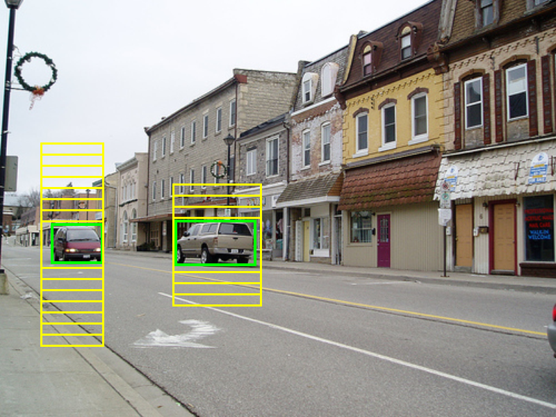

# Faster R-CNN in PyTorch and TensorFlow 2 w/ Keras
*Copyright 2021-2022 Bart Trzynadlowski*

## Overview

<p align="center">
   
</p>

This is a fresh implementation of the Faster R-CNN object detection model in both PyTorch and TensorFlow 2 with Keras, using Python 3.7 or higher. Although several years old now, Faster R-CNN remains a foundational work in the field and still influences modern object detectors.

I set out to replicate [the original paper](docs/publications/faster_rcnn.pdf) from scratch using Keras but quickly ran into difficulties and spent considerable time overcoming them. For the benefit of those undertaking a similar self-learning exercise -- whether involving this or other machine learning models -- my struggles, learnings, and observations are [documented here](#development-learnings).

My final results using the VOC2007 dataset's 5011 `trainval` images match the paper's. Convergence is achieved in 14 epochs (10 epochs at a learning rate of 0.001 and 4 more at 0.0001), consistent with the learning schedule the paper used. Both the PyTorch and Keras implementations include a VGG-16 backbone for feature extractor and for the stage just prior to box classification and regression. The PyTorch implementation also includes the option to use ResNet.

| Class | Average Precision (VGG-16) | Average Precision (ResNet50) | Average Precision (ResNet101) | Average Precision (ResNet152) |
|-------|----------------------------|------------------------------|-------------------------------|-------------------------------|
| cat        | 84.6% | 87.3% | 90.1% | 89.0% |
| car        | 84.0% | 85.5% | 88.5% | 88.4% |
| horse      | 82.3% | 84.8% | 87.4% | 87.3% |
| bus        | 81.8% | 84.1% | 85.9% | 86.6% |
| bicycle    | 80.9% | 81.2% | 84.8% | 85.8% |
| dog        | 80.2% | 81.0% | 83.8% | 84.5% |
| person     | 78.5% | 79.8% | 83.3% | 83.5% |
| train      | 77.2% | 79.8% | 82.3% | 82.8% |
| motorbike  | 76.6% | 79.5% | 81.3% | 82.3% |
| cow        | 75.8% | 79.0% | 79.6% | 81.2% |
| aeroplane  | 74.9% | 74.9% | 78.7% | 78.5% |
| tvmonitor  | 73.1% | 73.8% | 78.1% | 78.5% |
| sheep      | 67.6% | 71.7% | 77.2% | 76.0% |
| bird       | 66.0% | 70.6% | 76.1% | 72.8% |
| diningtable| 65.9% | 69.9% | 71.9% | 72.1% |
| sofa       | 65.1% | 67.2% | 65.3% | 67.4% |
| boat       | 57.4% | 59.9% | 64.2% | 62.9% |
| bottle     | 55.6% | 57.4% | 60.0% | 56.7% |
| chair      | 49.5% | 50.3% | 56.0% | 55.7% |
| pottedplant| 40.6% | 46.9% | 49.1% | 47.8% |
|**Mean**    | **71.0%** | **73.2%** | **76.2%** | **76.0%** |

## Background Material

Required literature for understanding Faster R-CNN:

- [*Very Deep Convolutional Networks for Large-Scale Image Recognition*](docs/publications/vgg16.pdf) by Karen Simonyan and Andrew Zisserman. Describes VGG-16, which serves as the backbone (the input stage and feature extractor) of Faster R-CNN.
- [*Fast R-CNN*](docs/publications/fast_rcnn.pdf) by Ross Girshick. Describes Fast R-CNN, a significant improvement over R-CNN. Faster R-CNN shares both its backbone and detector head (the final stages that produce boxes and class scores) with Fast R-CNN.
- [*Faster R-CNN: Towards Real-Time Object Detection with Region Proposal Networks*](docs/publications/faster_rcnn.pdf) by Shaoqing Ren, Kaiming He, Ross Girshick, and Jian Sun. Faster R-CNN improves upon Fast R-CNN by introducing a network that computes the initial object proposals directly, allowing all stages -- feature extraction, proposal generation, and final object detection -- to be trained together end-to-end.

Some informative web resources and existing code:

- [*Understanding Region of Interest -- (RoI Pooling)*](https://towardsdatascience.com/understanding-region-of-interest-part-1-roi-pooling-e4f5dd65bb44) by Kemal Erdem. A great explanation of RoI pooling.
- [*A Simple and Fast Implementation of Faster R-CNN*](https://github.com/chenyuntc/simple-faster-rcnn-pytorch) by Yun Chen. An excellent PyTorch implementation of Faster R-CNN.

ResNet, which popularized "skip connections" that allowed for training of much deeper models, can be used in place of VGG-16 as a backbone and provides improved accuracy:

- [*Deep Residual Learning for Image Recognition*](docs/publications/resnet.pdf) by Kaiming He, Xiangyu Zhang, Shaoqing Ren, and Jian Sun. Describes ResNet and includes results of using the architecture in Faster R-CNN.

## Environment Setup

Python 3.7 (for `dataclass` support) or higher is required and I personally use 3.9.7. Dependencies for the PyTorch and TensorFlow versions of the model are located in `pytorch/requirements.txt` and `tf2/requirements.txt`, respectively. Separate virtual environments for both are required.

Instructions here are given for Linux systems.

### PyTorch Setup with CUDA

The PyTorch version *requires* CUDA. I strongly recommend installing the latest CUDA version. Then, executing the following commands in the base Faster R-CNN source directory should create an environment and install the required dependencies:

```
python -m venv pytorch_venv
source pytorch_venv/bin/activate
pip install -r pytorch/requirements.txt
```

If this fails, go to the [PyTorch web site](https://pytorch.org/) and use their installation picker to select a pip package compatible with your version of CUDA. Run the command displayed there.

### TensorFlow 2 Setup

The TensorFlow version does not require CUDA, although its use is highly advised to achieve acceptable performance. TensorFlow environment set up *without* CUDA is very straightforward. The included `tf2/requirements.txt` file should suffice.

```
python -m venv tf2_venv
source tf2_venv/bin/activate
pip install -r tf2/requirements.txt
```

Getting CUDA working is more involved and beyond the scope of this document. On Linux, I use an NVIDIA docker container and `tf-nightly-gpu` packages. On Windows, with CUDA installed, the ordinary `tensorflow` package should just work out of the box with CUDA support.


## Dataset

This implementation of Faster R-CNN accepts [PASCAL Visual Object Classes](http://host.robots.ox.ac.uk/pascal/VOC/) datasets. The datasets are organized by year and VOC2007 is the default for
training and benchmarking. Images are split into `train`, `val`, and `test` splits, representing the training, validation, and test datasets. There is also a `trainval` split, which is the union of
`train` and `val`. This is what Faster R-CNN is trained on and `test` is used for validation. This is configurable on the command line.

The `download_dataset.sh` script will automatically fetch and extract VOC2007 to the default location: `VOCdevkit/VOC2007`. If your dataset is somewhere else, use `--dataset-dir` to point the program to it.

## Pre-Trained Models and Initial Weights

To train the model, initial weights for the shared VGG-16 layers are required. Keras provides these but PyTorch does not. Instead, the PyTorch model supports initialization from one of two sources:

1. Pre-trained VGG-16 Caffe weights that can be found online as `vgg16_caffe.pth` (SHA1: `e6527a06abfac585939b8d50f235569a33190570`).
2. Pre-trained VGG-16 weights obtained using [my own Keras model](https://github.com/trzy/VGG16).

Fortunately, `vgg16_caffe.pth` and pre-trained Faster R-CNN weights for both the PyTorch and TensorFlow versions can be obtained using `download_models.sh`. My web host is not particularly reliable so if the site is down, try again later or contact me. The models were trained using the scripts included in this repository (`train_pytorch_vgg16.sh`, `train_pytorch_resnet50.sh`, and `train_tf2.sh`).

When training the TensorFlow version of the model from scratch and no initial weights are loaded explicitly, the Keras pre-trained VGG-16 weights will automatically be used. When training the PyTorch version, remember to load initial VGG-16 weights explicitly, e.g.:

```
python -m pytorch.FasterRCNN --train --epochs=10 --learning-rate=1e-3 --load-from=vgg16_caffe.pth
```

## Running the Model

From the base directory and assuming the proper environment is configured, the PyTorch model is run like this:

```
python -m pytorch.FasterRCNN
```

And the TensorFlow model like this:
```
python -m tf2.FasterRCNN
```

Use `--help` for a summary of options or poke around the included scripts as well as `pytorch/FasterRCNN/__main__.py` and `tf2/FasterRCNN/__main__.py`. Most of the command line syntax is shared between both models. The Keras version has a few more configuration options.

### Training the Model

Numerous training parameters are available. Defaults are set to be consistent with the original paper. Some hyperparameters, such as mini-batch sampling and various detection thresholds, are hard-coded and not exposed via the command line.

Replicating the paper results requires training with stochastic gradient descent (the only option in the PyTorch version; the default in the TensorFlow version) for 10 epochs at a learning rate of 0.001 and a subsequent 4 epochs at 0.0001. The default momentum and weight decay are 0.9 and 5e-4, respectively, and image augmentation via random horizontal flips is enabled.

```
python -m pytorch.FasterRCNN --train --learning-rate=1e-3 --epochs=10 --load-from=vgg16_caffe.pth --save-best-to=results_1.pth
python -m pytorch.FasterRCNN --train --learning-rate=1e-4 --epochs=4 --load-from=results_1.pth --save-best-to=results_final.pth
```

This assumes that the dataset is present at `VOCdevkit/VOC2007/`. The mean average precision is computed from a subset of evaluation samples after each epoch and the best weights are saved at the end of training. The final model weights, regardless of accuracy, can also be saved using `--save-to` and checkpoints can be saved after each epoch to a directory using `--checkpoint-dir`.

**NOTE:** The data loader is simple but slow. If you have the CPU memory to spare (80-100 GB), `--cache-images` retains all images in memory after they are first read from disk, improving performance.

The TensorFlow version has additional options. Namely, a choice of optimizer (SGD or Adam), two RoI pooling implementations, and the option for the detector stage to output logits rather than probabilities. TensorFlow lacks an exact RoI pooling operation so by default, an approximation involving `tf.image.crop_and_resize` is used. A custom RoI pooling layer was implemented as a learning exercise but is too slow for practical use. When loading saved weights, make sure to set options consistently.

For a complete list of options use `--help`.

### Running Predictions

There are three ways to run predictions on images:

1. `--predict`: Takes a URL (local file or web URL), runs prediction, and displays the results.
2. `--predict-to-file`: Takes a URL, runs prediction, and writes the results to an image file named `predictions.png`.
3. `--predict-all`: Takes a training split from the dataset (e.g., `test`, `train`, etc.) and runs prediction on all images within it. Writes each image result to a directory named after the split (e.g., `predictions_test/`, `predictions_train/`).

Examples of each:

```
python -m tf2.FasterRCNN --load-from=saved_weights.h5 --predict=http://trzy.org/files/fasterrcnn/gary.jpg
python -m tf2.FasterRCNN --load-from=saved_weights.h5 --predict-to-file=image.png
python -m tf2.FasterRCNN --load-from=saved_weights.h5 --predict-all=test
```

### ResNet Backbone

The PyTorch version supports different backbones. In addition to VGG-16, a few variants of ResNet (ResNet50, ResNet101, and ResNet152) are available. The `--backbone` option is used to specify one of the following backbones:

| Argument | Backbone Description |
|----------|----------------------|
| `vgg16` | Custom VGG-16 backbone. The default. |
| `vgg16-torch` | VGG-16 backbone implemented using Torchvision's pre-trained VGG-16 layers. |
| `resnet50` | ResNet50 backbone implemented using Torchvision's pre-trained ResNet50 layers. |
| `resnet101` | ResNet101 backbone implemented using Torchvision's pre-trained ResNet101 layers. |
| `resnet152` | ResNet152 backbone implemented using Torchvision's pre-trained ResNet152 layers. |

All but `vgg16` load Torchvision pre-trained weights and therefore do not need to be initialized with an explicit weights file. When loading weights to resume training, the backbone must be set to be same as the one used to produce the weights. The `vgg16-torch` implementation does not accept the same weights files as `vgg16`, including `vgg16_caffe.pth`. It automatically
initializes itself using the built-in Torchvision weights (also trained on ImageNet but expecting a slightly different image pre-processing scheme) and therefore can be run without any input file. It also serves as an example of how to create a new backbone class.

Here is an example of how to train a model using a ResNet101 backbone:

```
python -m pytorch.FasterRCNN --train --backbone=resnet101 --learning-rate=1e-3 --epochs=10 --save-best-to=results_1.pth
python -m pytorch.FasterRCNN --train --backbone=resnet101 --learning-rate=1e-4 --epochs=4 --load-from=results_1.pth --save-best-to=results_final.pth
```

**Important**: When running inference with a ResNet checkpoint, the matching backbone architecture must explicitly be specified with `--backbone`, otherwise the default backbone (VGG-16) will be assumed and the checkpoint will fail to load. For example, to use the above trained ResNet101 model:

```
python -m pytorch.FasterRCNN --backbone=resnet101 --load-from=results_final.pth --predict=http://trzy.org/files/fasterrcnn/gary.jpg
```

The TensorFlow version does not support alternative backbones yet.

## Development Learnings

I encountered numerous difficulties getting these models working. My initial hope was to rely only on [the paper](docs/publications/faster_rcnn.pdf) but I had to give in and take a peak at existing code bases because there are some important details that are not expounded in the paper. If you are struggling with a
similar situation, take heart and remember you are not alone! Below are some important things I learned along the way.

### Use Object *and* Background Proposals for Training

The region proposal network (RPN) generates a box at each anchor consisting of a score (the *objectness score*) and coordinates. The published implementation uses a binary classification scheme with two mutually exclusive one-hot encoded class outputs per anchor: object and background. Softmax is applied to each pair of
signals for every anchor. This is redundant and my implementation produces a single output with a sigmoid activation, which is equivalent. Each box is labeled as being an object (1.0) or background (0.0). Output scores above 0.5 can be interpreted as objects. These boxes are then passed to a labeling stage that decides whether they
sufficiently overlap with ground truth object boxes. If so, the boxes are labeled according to the class of the overlapping ground truth box. Otherwise, they are labeled as background. That is, the RPN can suggest that a box contains an object but it can be wrong. The set of labeled boxes, called *proposals* or *regions of interest*, are then passed to the detector stage.

I initially wrongly assumed that only those boxes that the RPN predicted to be *objects* should be passed along and labeled and that background results should be pruned immediately. The model learned but did so poorly. The mean average precision was well below 50% (possibly as low as 30-40%, if I remember correctly). I was stumped for an embarrassingly long time. The model
was obviously learning *something* only *not well enough*. Why?

Eventually, I relented and looked at other implementations and realized that RPN outputs should *not* be filtered. Rather, the objectness score should be used to sort them and the top *N* should be labeled and passed to the detector stage even if the RPN has classified them as background. In the original implementation, the
RPN object class output was used as a score and the background output was ignored entirely. In my implementation, the single output itself can be interpreted as a score.

In order to train the detector stage, Faster R-CNN needs to see a lot of examples. By putting too much trust into the RPN's judgment, I was excluding a huge number of proposals. And because all stages of Faster R-CNN are jointly trained, passing on boxes erroneously classified as background by the RPN still allows
the detector stage to continue learning because labeling (see the function `FasterRCNNModel._label_proposals()` in both versions of my model) is decided independently of the RPN's predictions.

**Takeaway Lesson:** If your object detector is learning but seems to be struggling to achieve high precision, consider whether
you are inadvertently limiting the amount of samples it is exposed to during training.

### Anchor Label Quality

Anchors are conceptually very simple but it is *very* easy to botch them. I rewrote my implementation several times and still got it wrong. I would never have discovered this had I not compared my anchor labels to those of other implementations. One particularly nasty issue I encountered was that using double precision
coordinates could adversely affect anchor labeling. Consider the two examples below. The green boxes are the ground truth object boxes and the yellow boxes are the anchors that overlap sufficiently with a ground truth box to be labeled as *object* anchors. Specifically, those anchors whose *intersection-over-union* (IoU) with a
ground truth box is greater than or equal to 70% or, if no anchors meet this threshold, the highest scoring anchor(s).

<p align="center">
   
</p>

The image on the left is correct and the one on the right is wrong. Both were generated using identical code (`generate_anchor_maps()` in `anchors.py`) but the correct anchors were produced by casting the final results to `np.float32` from `np.float64`.

Why is it so sensitive? The reason is that it is acceptable for *multiple* anchors to be labeled as object anchors. In some cases, all anchors will have less than 70% IoU and the ground truth box will be small enough to fit entirely inside of multiple anchors, as happens here. In such cases, the IoU score should be
exactly the same but precision issues may create a very tiny discrepancy, causing some anchors to appear to score "better" than others.

**Takeaway Lesson:** Don't double-check your anchor code. Don't triple-check it. Check it at least 10 times. And then check it 10 more times once further along in implementing the rest of the model. There are plenty of other ways to screw up anchor labeling, too.

### Saving State in PyTorch

Suppose you save your model like this:

```
t.save({
  "epoch": epoch,
  "model_state_dict": model.state_dict(),
  "optimizer_state_dict": optimizer.state_dict()
}, filename)
```

And then load it like this:

```
state = t.load(filename)
model.load_state_dict(state["model_state_dict"])
optimizer.load_state_dict(state["optimizer_state_dict"])
```

What could possibly go wrong? This left me pulling my hair out for *weeks*. My model was achieving very good mean average precision scores, comparable to the paper and other implementations, but the predicted boxes seemed ever-so-slightly worse when examined visually. The effect was subtle and random.

I went through every line of code tearing the model apart and putting it back together. At last, after glancing at these lines for what seemed like the thousandth time, it hit me: I was saving the optimizer state, as I had seen done elsewhere in PyTorch examples, but was also *loading* it again. The training process
involves changing the learning rate after 10 epochs. In my implementation, this is done by re-running the program initialized with the previous run's weights, but I was clobbering the new learning rate with the *old* one.

**Takeaway Lesson:** When saving and loading model state, pay careful attention to what it actually includes.

### Instabilities in TensorFlow Due to Gradient Propagation

The reason the TensorFlow version includes an alternative choice of optimizer and other options (`--clipnorm` and `--detector-logits`) is because I added them while debugging convergence issues that plagued me for weeks. The first sign of trouble was the appearance of NaNs in the loss that would then clobber all the
weights and prevent further training. Having seen the use of gradient norm clipping in [Matterport's MaskRCNN implementation](https://github.com/matterport/Mask_RCNN), I added the `--clipnorm` option and the NaNs mostly disappeared when using values of 4.0 or less. They would ocassionally appear in the loss but this turned out to be an innocuous and rare issue: no valid proposals generated by the RPN. The fix was obvious; see
the change to `detector.py` in commit `aed8143`.

But now I had a new puzzle: the model was failing to converge to the same precision as PyTorch. Gradient clipping can help accelerate the convergence of models that suffer from exploding gradients or have loss functions that vary sharply but it works by clipping the magnitude of the gradient, which I figured could slow
down training in my case and require a modified learning schedule. I tried giving the model more time and also experimented with Adam and different learning rates but nothing helped. I could not achieve a mean average precision higher than about 50%.

Looking at other TensorFlow implementations of Faster R-CNN, I stumbled upon the use of `tf.stop_gradient()` in the regression loss functions in one code base. Lo and behold, this magically fixed the problem, and eliminated the NaNs that were the initial sign of trouble.

I still do not understand why avoiding backprop through the `tf.less` operation is necessary in TensorFlow nor how I could have pinpointed this on my own. Despite being implemented as a piecewise function, the regression loss *is* continuous at all points and the PyTorch version does not require this "fix" at all. Anyone willing to help me understand
is encouraged to email me!

**Takeaway Lesson:** Learn to understand what exactly gradients in your code are doing. Don't reach for gradient clipping until you are absolutely sure it is necessary.

### PyTorch Memory Leaks

Proposal boxes fed into the detector stage are supposed to be treated as constant inputs. That is, gradients are not computed for them. I initially used the same approach as [Yun Chen's Faster R-CNN implementation](https://github.com/chenyuntc/simple-faster-rcnn-pytorch): keep proposals on the CPU as NumPy arrays. To squeeze
out a little more performance, I decided to convert the code to PyTorch CUDA tensors. To prevent backprop, the proposal and detector ground truth tensors are detached from the graph in `FasterRCNNModel.train_step()`. To my astonishment, this introduced a CUDA memory leak!

I am still not sure *why* memory is being leaked. It appears some intermediate tensors are being kept alive. I managed to identify a fix using an excellent [CUDA memory profiling tool by Nader Akoury](https://gist.github.com/dojoteef/26cd46f7cc38b38e6f443c5f62411aa3), now included in this code base. I have filed [a bug
report](https://github.com/pytorch/pytorch/issues/71495) on the PyTorch project, which explains the problem in more detail. It could be my mistake but I do not understand how.

**Takeaway Lesson:** Frameworks like PyTorch and TensorFlow cannot be treated as black boxes forever. Sometimes you have to dig in and really understand what is going on at a low level.

## Suggestions for Future Improvement

- Better data loaders that can prefetch samples automatically. Both PyTorch and TensorFlow provide functionality that can accomplish this.
- Support for [COCO](https://cocodataset.org) and other datasets.
- Support for batch sizes larger than one. This could be accomplished by resizing all images to the width of the largest image in the dataset, padding the additional space with black pixels, and ensuring that the ground truth RPN map ignores the padded space by marking anchors within it invalid. A substantial amount of code assumes a batch size of one and would need to be modified.
- Replacement of the ground truth RPN map -- which stores anchor validity, object/background label, and box delta regression targets in a single tensor -- with simpler lists of anchors and labels. This would greatly simplify the loss functions, among other code, and potentially improve performance.
- Better custom RoI pooling implementation for TensorFlow. This will almost certainly require writing a CUDA implementation. There are examples of this online.


